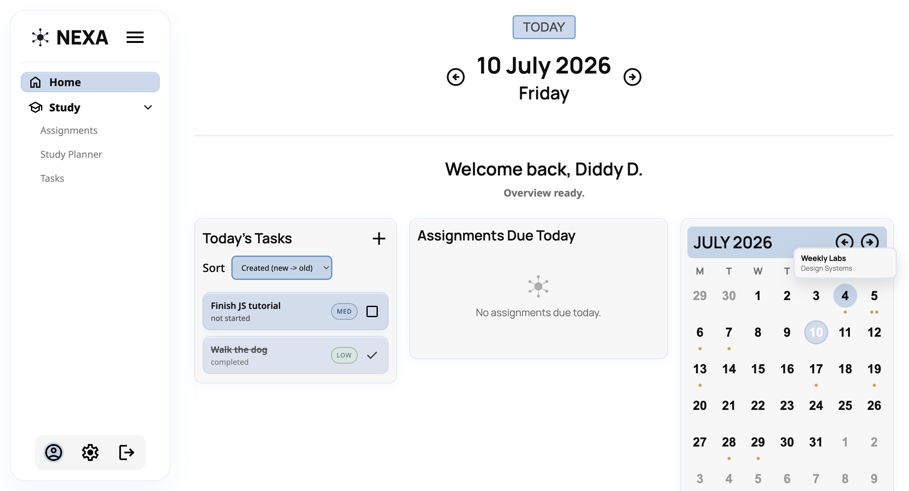
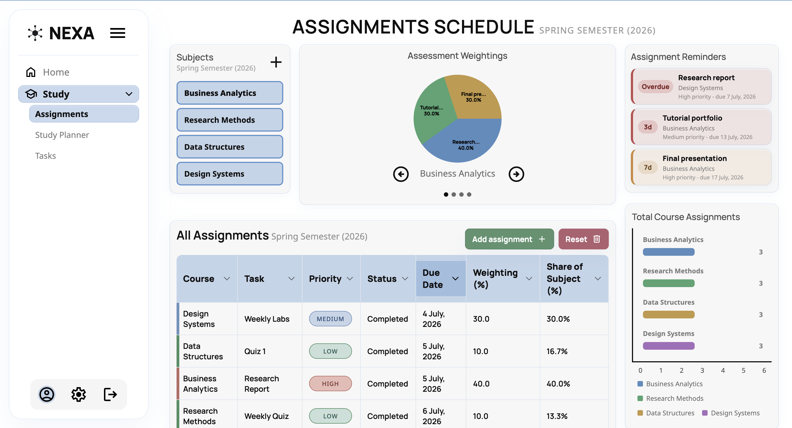
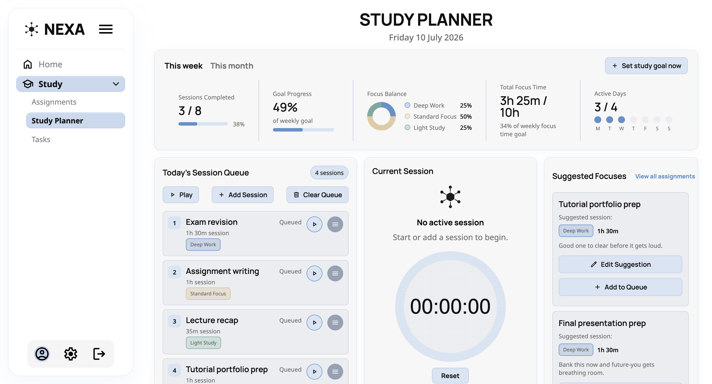
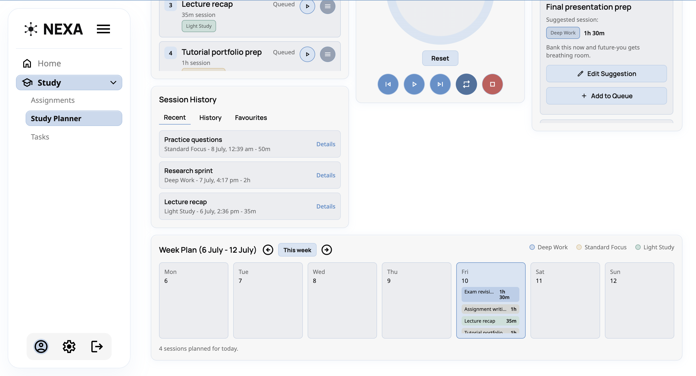
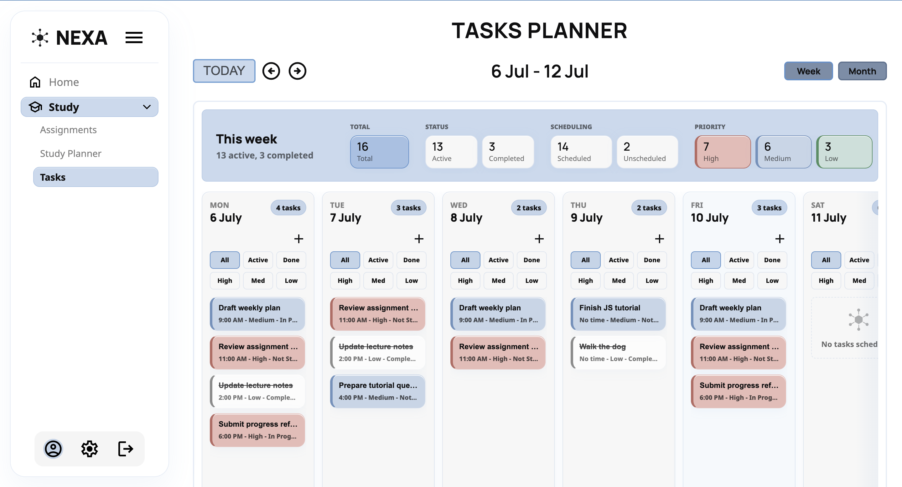
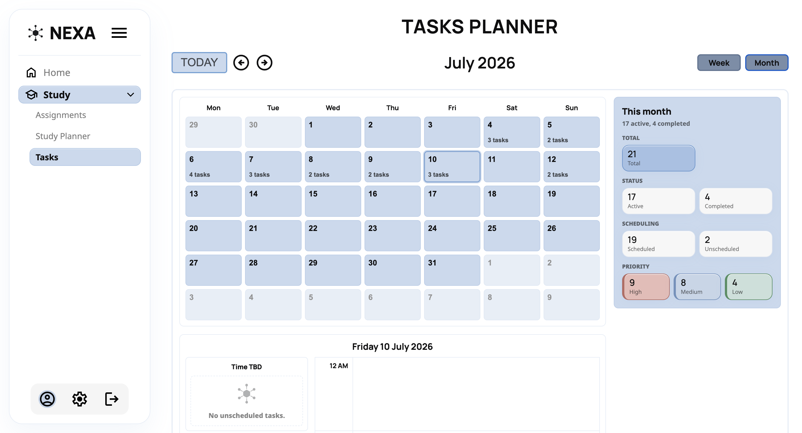
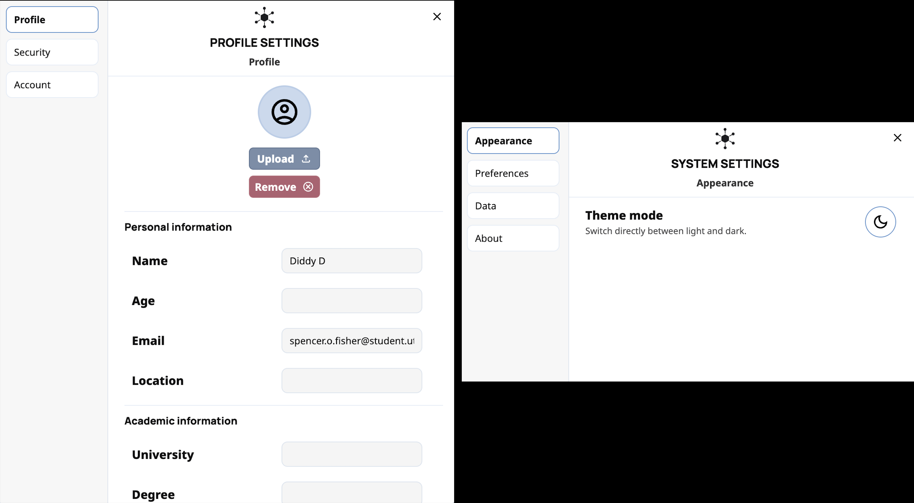
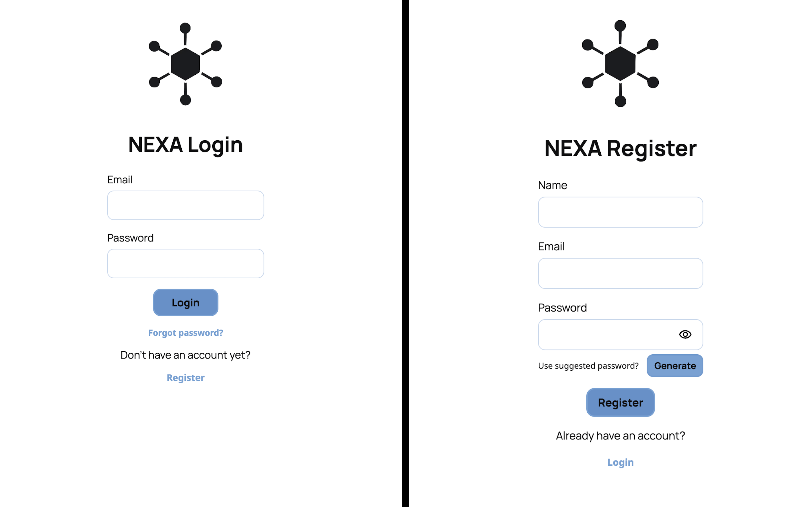
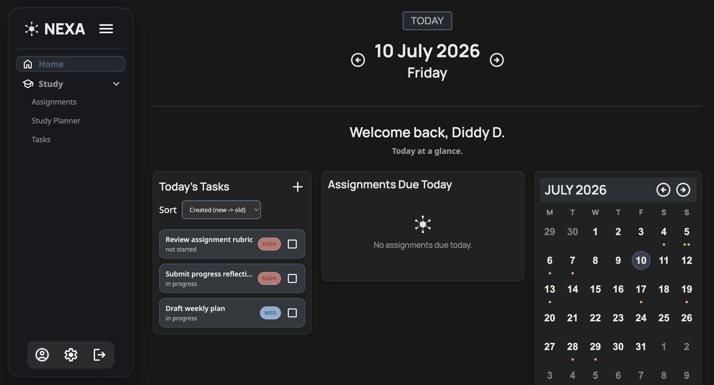

# NEXA - Student Workload Management Tool

A student-focused academic planning web application designed to help manage assignments, tasks, and study workload in one clear interface.

I built Nexa to solve a problem I repeatedly faced as a student: academic work often becomes scattered across separate tools, making it harder to see what is due, what needs attention, and how to plan work effectively. Nexa brings assignment tracking, task management, calendar-based planning, and study session organisation into a focused academic workflow.

The project was built as a full-stack personal software project, with an emphasis on practical usability, clean interface design, and structured academic planning.

*Live version: https://nexa-next.vercel.app/*

---

## Features

- **Dashboard home page**
    - Overview of today's tasks and assignments due today
    - Calendar view for quick navigation
- **Tasks Planner**
    - Weekly and monthly planning views
    - Ability to schedule tasks across days and times
- **Assignments tracker**
    - Track assignments per subject
    - View assessment weightings
    - Assignment status tracking i.e., not started, in progress, completed
- **Study Planner**
    - Organise study sessions by subject, intensity, and completion status
    - Track weekly and monthly study goals
    - Review study workload through calendar-based summaries
- **Academic workload visibility**
    - Visual widgets for assignment weightings, priority, and progress
    - Calendar and planning views designed around student deadlines
- **Email reminders**
    - Optional reminder emails for important and weekly academic planning
- **Dark Mode**
    - Toggle between light and dark mode interfaces to account for different user preferences
- **Data Storage**
    - Node.js, Express, and PostgreSQL backend for user authentication and persistent per-user data

---

## Screenshots

### Home Page



### Assignments Page



### Study Session Planner



### Study Session Planner Additional View



### Tasks Page - Week View



### Tasks Page - Month View



### Account and System Settings



### Authentication Flow



### Dark Mode Example (Main Dashboard)



---

## Tech Stack

- **EJS**, **HTML**, **CSS**, and **JavaScript** for the interface
- **Node.js** and **Express** for the backend server
- **PostgreSQL** for persistent data storage
- **Passport**, **bcrypt**, and server-side sessions for authentication
- **Nodemailer** for account and reminder emails
- **Vercel** for deployment

---

## Running the Project

Clone the repository:

```bash
git clone https://github.com/spncr1/nexa-v2.git
cd nexa-v2
```

Install dependencies:

```bash
npm install
```

Create a `.env` file in the project root. For local development, provide either a `DATABASE_URL` or the individual PostgreSQL values:

```env
SESSION_SECRET=replace-with-a-long-random-string
APP_BASE_URL=http://localhost:3000

PGHOST=localhost
PGPORT=5432
PGUSER=your_postgres_user
PGPASSWORD=your_postgres_password
PGDATABASE=nexa_v1
```

Email verification, password reset, and reminder emails also need SMTP values:

```env
SMTP_HOST=your_smtp_host
SMTP_PORT=587
SMTP_SECURE=false
SMTP_USER=your_smtp_username
SMTP_PASS=your_smtp_password
MAIL_FROM="Nexa <no-reply@example.com>"
```

Run the development server:

```bash
npm run dev
```

Then open the local URL shown in the terminal:

```bash
http://localhost:3000/login
```

The app checks the PostgreSQL connection and runs pending database migrations on startup.
